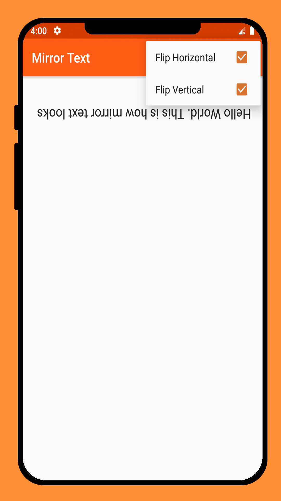

# Mirror Text

----

<table>
    <tr>
        <th>Title</th>
        <td>Mirror Text</td>
    </tr>
    <tr>
        <th>Short description</th>
        <td>See how your message looks when mirrored.</td>
    </tr>
    <tr>
        <th>Full description</th>
        <td> Mirror your messages   This is an open source application. You can view its source code on github [kashew-developers/MirrorText](https://github.com/kashew-developers/MirrorText)</td>
    </tr>
    <tr>
        <th>YouTube</th>
        <td>https://youtu.be/i9vtgH0XqI4</td>
    </tr>
</table>

----

#### Screenshots

<table>
    <tr>
        <td></td>
        <td></td>
        <td></td>
    </tr>
    <tr>
        <td></td>
        <td></td>
        <td></td>
    </tr>
</table>
